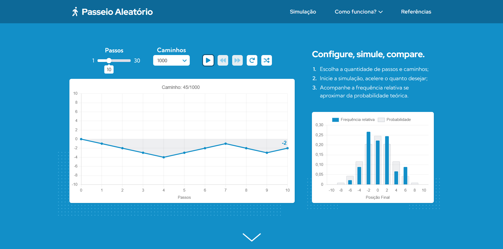
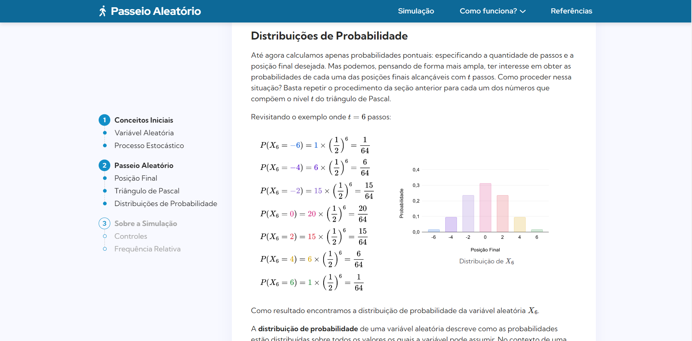

# Passeio Aleatório

Este projeto consiste de uma página web que simula realizações de um passeio aleatório. Além da simulação, o projeto dispõe de um artigo fortemente baseado em exemplos que explica a teoria e o funcionamento
do experimento. 

## Table of contents

- [Visão Geral](#visão-geral)
  - [Ideia Inicial](#-ideia-inicial)
  - [Screenshots](#-screenshots)
  - [Links](#-links)
- [Desenvolvimento](#desenvolvimento)
  - [Tecnologias e Ferramentas](#-tecnologias-e-ferramentas)
  - [Aprendizado](#-aprendizado)
  - [Dificuldades](#-dificuldades)
  - [Próximos Passos](#-próximos-passos)
- [Autor](#autor)

## Visão Geral

### 🎯 Ideia Inicial

No início, ainda durante a fase de planejamento, eu já tinha em mente que queria por em prática alguns conhecimentos. Dentre eles:

- Desenvolver um dropdown em cascata;
- Usar Chart.js para exibir gráficos;
- Fixar um elemento com position: sticky;
- Usar as tags semânticas do HTML: header, main, footer, article, section;
- Implementar transições estilizadas de background;
- Acompanhar a leitura aplicando estilos ao menu lateral;
- Usar o figma para prototipar algo minimamente útil.

Complementar a tudo isso abdiquei do uso do Angular e do Sass. A simulação era relativamente simples e na minha cabeça super fazia sentido abrir mão dessas tecnologias. No fundo eu queria aproveitar a oportunidae para ter uma noção de como seria desenvolver algo sem frameworks e pré-processadores. \
Com exceção dos gráficos com Chart.js e das equações com MathJax, todo o resto foi feito do zero.

### 📸 Screenshots

Simulação

Artigo

### 🔗 Links

- Live site: [Acesse a simulação](vitorp4.github.io/random-walk)
- Repositório: [Repositório no Github](vitorp4.github.io/random-walk)
- Protótipo de design: [Protótipo inacabado no figma](https://www.figma.com/file/0DAlZkaMiXcSbp84pWthvS/random-walk?node-id=0%3A1)
- Inspiração de design: [JSON Formatter](https://jsonformatter.curiousconcept.com/)

## Desenvolvimento

### 🔨 Tecnologias e Ferramentas

- HTML
- CSS
- Javascript
- Chart.js
- MathJax
- Figma
- InkScape

### 🎓 Dificuldades

Lidar com o CSS foi o maior dos problemas. Desenvolver um design agradável para diferentes tamanhos de tela, estilizar o input range e fixar o menu lateral deram uma dor de cabeça. Escolher a paleta de cores então nem se fala. Usar CSS sem pré-processador foi ótimo pro aprendizado, mas em questão de praticidade...

### 🔮 Próximos Passos

Ainda na vibe do frontend quero desenvolver algo com dark/light theme. Preciso aprender a nomear as classes CSS de forma mais eficiente e maturar a implementação de uma interfaces responsivas. \
Fora isso preciso praticar mais a integração com o backend, algo que não foi possível nesse projeto. \
Ando pesnando no que fazer em seguida. Só sei que com certeza dever ser algo com Node.js.

## Autor
Me encontre no:

- Github - [@vitorp4](https://github.com/vitorp4)
- CodePen - [@vitorp4](https://codepen.io/vitorp4)
- Medium - [@vitorp4](https://medium.com/@vitorp4)
- Linkedin - [João Gomes](www.linkedin.com/in/joão-vitor-da-silva-gomes-a55a211b4)
- Frontend Mentor - [@vitorp4](https://www.frontendmentor.io/profile/vitorp4)